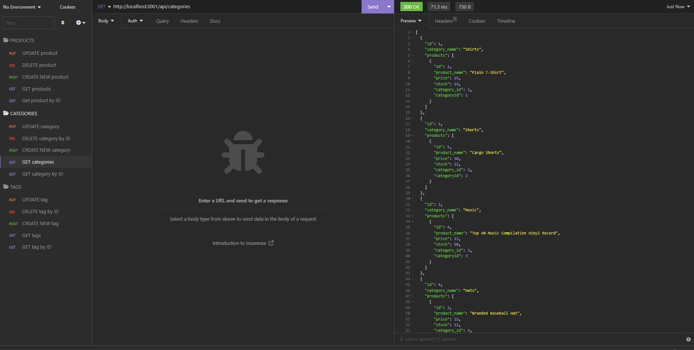

# E-Commerce_backend
Backend application used to support inventory database

## Description
Main Topic: Express.js API, Sequelize and MySQL

This is an Express API that can be used to request product information about a company's inventory. The inventory is divided into categories, with a product belonging to a certain category and each product is given a tag. MySQL handles the inventory database and the API allows for GET, PUT, POST, UPDATE and DELETE request to the database.


## Screenshot
Insomnia exmaple



## Link
[Video Link](https://drive.google.com/file/d/1F1w2Y9tBTBGz2nn5arFDOL5eN8LJZxi3/view)


## Developed by:
```
John Foxwell
```

